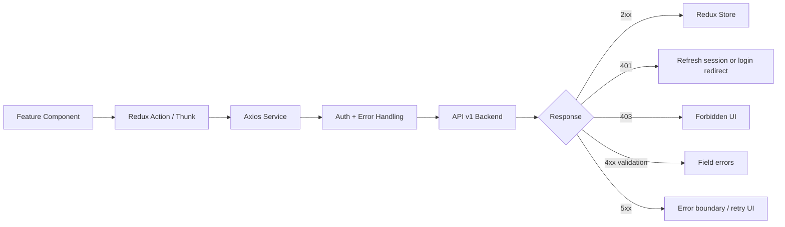

# API Integration Flow

Shows how a feature component triggers an API call and how the response flows through the Axios client and Redux store.

## Error Handling Per Status

| Status | Frontend Behavior |
|---|---|
| `401` | Clear session cache, redirect to login |
| `403` | Show forbidden page or inline permission message |
| `404` | Show not found page or inline row state |
| Validation `4xx` | Map field errors to form fields |
| `5xx` | Show retryable error state with correlation ID |
| Platform busy | Show capacity message, refresh queue snapshot |

## Related
- [[frontend-architecture]] — Full API integration design section
- [[route-guard-flow]] — Auth guard runs before API calls
- [[realtime-state-flow]] — WebSocket updates Redux alongside REST
- [[ADR-012]] — Axios decision
- [[ADR-011]] — Redux state management
