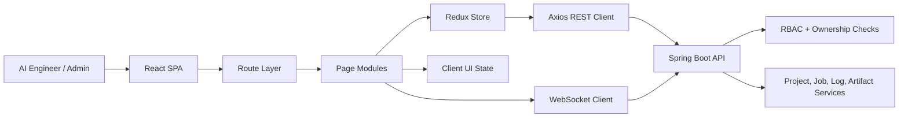

# Frontend Architecture Context

Shows the React SPA internal structure and its connection to the Spring Boot backend.

## Layer Responsibilities

| Layer | Responsibility |
|---|---|
| Route Layer | Authentication guard, role guard, resource-ownership routing |
| Page Modules | Route-level pages decomposed into focused widgets |
| Redux Store | Domain state (auth, projects, jobs, logs, artifacts, notifications) |
| Client UI State | Local transient state (dialogs, draft text, filter values) |
| Axios REST Client | Shared Axios instance with auth, error normalization, correlation ID |
| WebSocket Client | Job stream connect/reconnect/dedup/fallback |

## Related
- [[frontend-architecture]] — Full architecture document
- [[api-integration-flow]] — Axios call chain detail
- [[realtime-state-flow]] — WebSocket state management
- [[route-guard-flow]] — Route guard logic
- [[high-level-component-diagram]] — Backend modules the frontend calls
