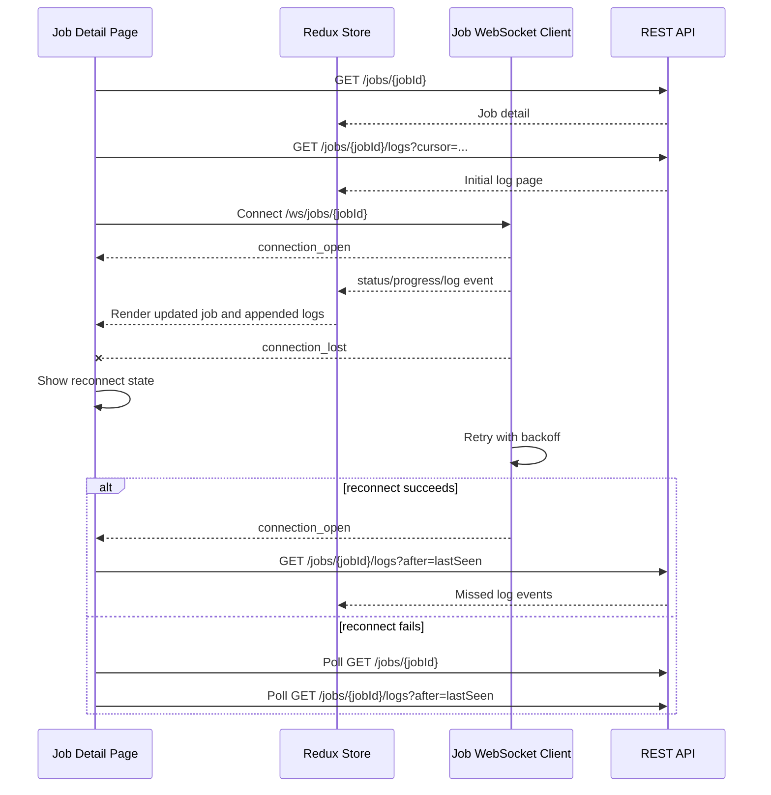

# Real-Time State Flow

Shows how the Job Detail page loads initial data, connects to WebSocket, handles reconnect, and falls back to REST polling.

## Reconnect Behavior

1. Show degraded connection state in UI
2. Retry WebSocket connection with exponential backoff
3. If reconnect succeeds: fetch missed events since `lastSeen`
4. If reconnect fails: fall back to REST polling

Duplicate events are ignored using monotonic sequence or log offset.

## Related
- [[api-integration-flow]] — REST call chain
- [[log-streaming-architecture-diagram]] — Backend streaming architecture
- [[frontend-architecture]] — WebSocket design section
- [[ADR-008]] — WebSocket + REST fallback decision
- [[non-functional-requirements]] — NFR-UX-005 (reconnect state visible)
