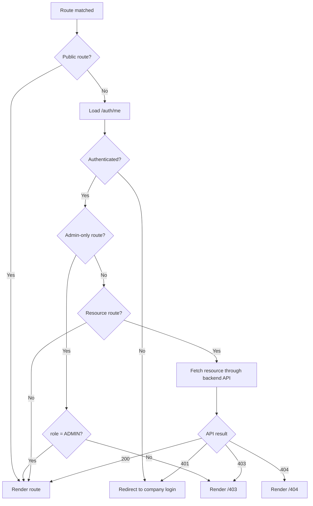

# Route Guard Flow

Shows how route access is controlled for public routes, authenticated routes, admin-only routes, and resource-ownership routes.

## Route Groups

| Route | Guard |
|---|---|
| `/login`, `/register`, `/login/callback` | Public |
| `/projects`, `/projects/new`, `/notifications` | Authenticated |
| `/projects/:projectId`, `/jobs/:jobId` | Authenticated + resource ownership (backend-enforced) |
| `/admin/users`, `/admin/queue` | Admin role |

## Related
- [[frontend-architecture]] — Full routing table and URL state design
- [[api-integration-flow]] — REST calls that enforce ownership
- [[request-authorization-flow]] — Backend auth sequence
- [[access-control-matrix]] — What admins vs users can access
