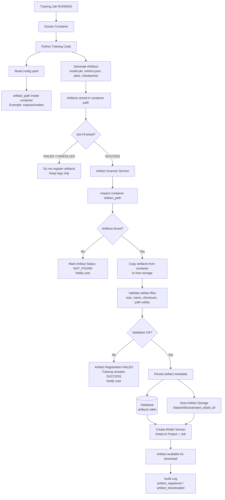

# Artifact Flow Diagram

Shows how training artifacts (model files, metrics, checkpoints) are discovered, copied, registered, and linked to a model version after a successful job.

## Key Rules
- Artifacts are only registered on `SUCCESS` — not on `FAILED` or `CANCELLED`
- Artifact registration failure does NOT change the job status (`SUCCESS` remains `SUCCESS`)
- `artifact_path` is read from the YAML configuration snapshot (not hardcoded)
- Path traversal and unsafe symlinks are rejected during validation

## Related
- [[configuration-management-flow-diagram]] — Where `artifact_path` is defined
- [[storage-layout-diagram]] — Physical path `/data/artifacts/`
- [[erd]] — `ARTIFACTS` and `MODEL_VERSIONS` tables
- [[ADR-009]] — Storage decision
- [[non-functional-requirements]] — NFR-REL-007, NFR-SEC-006, NFR-STO-003
- [[failure-handling-matrix]] — Artifact registration failure row
