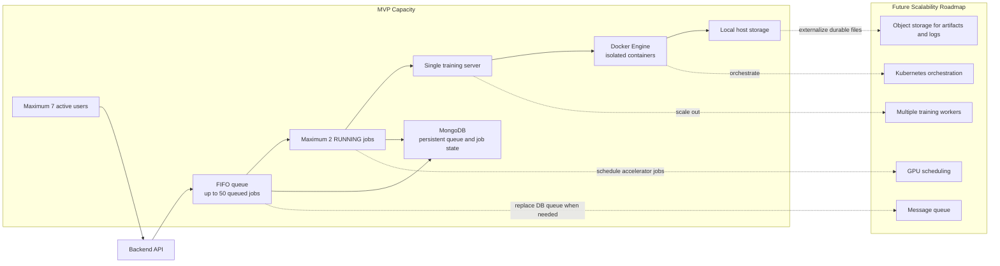

# Capacity and Scalability View

Shows the MVP capacity constraints and the future scalability roadmap when multi-worker execution is needed.

## MVP Limits

| Constraint | Value | NFR Reference |
|---|---|---|
| Active users | 7 | NFR-CAP-001 |
| Concurrent RUNNING jobs | 2 | NFR-CAP-002 |
| Queue capacity | 50 | NFR-CAP-003 |
| Execution servers | 1 | Architecture constraint |

## Future Evolution Path
1. Add a message broker (RabbitMQ/Kafka) to replace DB-backed queue
2. Scale to multiple training servers
3. Move to Kubernetes for container orchestration
4. Introduce GPU scheduling
5. Move artifacts/logs to object storage (S3-compatible)

## Related
- [[ADR-005]] — Why DB-backed queue is sufficient for MVP
- [[ADR-006]] — Docker execution (can evolve to Kubernetes)
- [[ADR-009]] — Local storage (can evolve to object storage)
- [[non-functional-requirements]] — NFR-CAP section
- [[queue-flow-diagram]] — Current queue implementation
