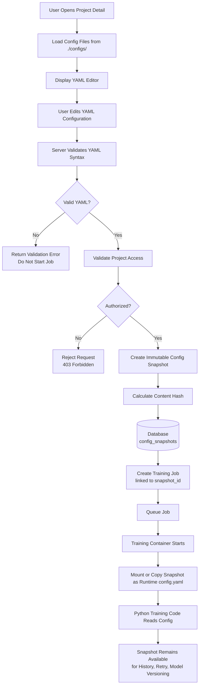

# Configuration Management Flow Diagram

Shows how a YAML configuration is edited, validated, snapshotted, and used during training execution.

## Key Rules
- Snapshots are **immutable** once a job is created (see [[non-functional-requirements]] NFR-DATA-001)
- The snapshot is linked to the job, model version, and artifact record for full reproducibility
- Users can freely edit YAML before starting — only the submitted value is snapshotted

## Related
- [[project-registration-flow-diagram]] — Where configs/ directory comes from
- [[artifact-flow-diagram]] — Artifact path is read from the snapshot
- [[erd]] — `CONFIG_SNAPSHOTS` table and relationships
- [[sa-refinement]] — Section 4: configuration management
- [[ADR-004]] — Snapshot persistence in MongoDB
