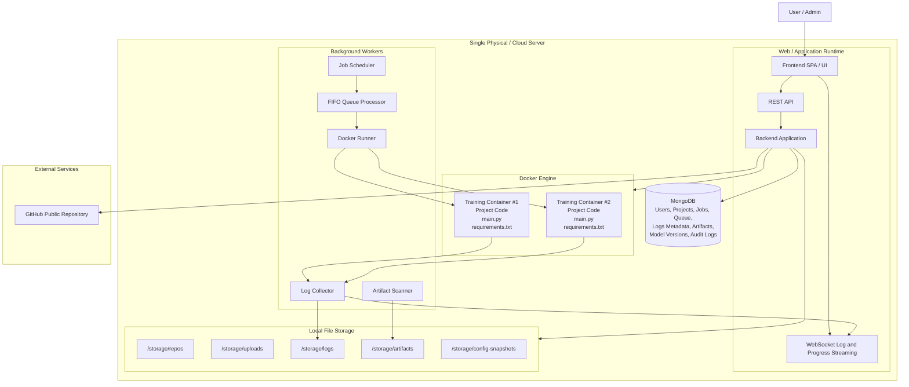

# Deployment Diagram

Shows the physical/logical deployment of the platform on a single server. **The backend runs on the host; Docker provides only MongoDB and the Nginx frontend container.**

## Startup Order

1. Build frontend bundle: `npm ci && npm run build`
2. `docker compose up -d --build` — starts MongoDB + Nginx frontend
3. `mvn spring-boot:run` in `backend/` — starts the Spring Boot API on port 8080

Nginx proxies `/api/` and WebSocket traffic to `host.docker.internal:8080`.

## Related
- [[system-context-diagram]] — External context
- [[high-level-component-diagram]] — Internal modules
- [[storage-layout-diagram]] — Detail on `/data` layout
- [[ADR-001]] — Backend runs on host (not in container)
- [[ADR-004]] — MongoDB in Docker
- [[ADR-006]] — Training containers
- [[ADR-009]] — Local storage
