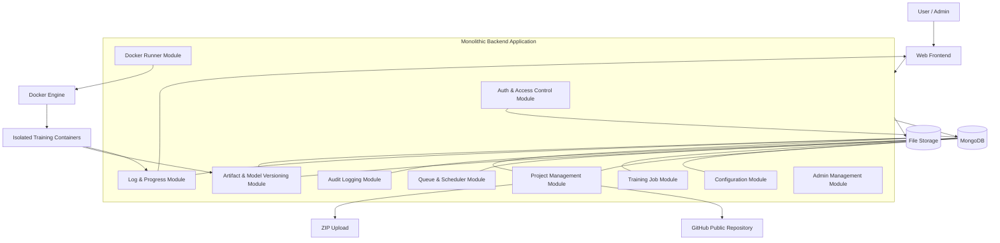

# High-Level Component Diagram

Shows the internal modules of the monolithic backend and how they connect to external infrastructure.

## Module Responsibilities

| Module | Responsibility |
|---|---|
| Auth & Access Control | Identity verification, RBAC, ownership checks (→ `AuthorizationService` Facade) |
| Project Management | GitHub clone, ZIP upload/extract, project CRUD |
| Configuration | YAML editing, validation, immutable snapshot creation |
| Training Job | Job lifecycle management, status transitions |
| Queue & Scheduler | FIFO queue persistence, dispatcher loop (2 concurrent jobs) |
| Docker Runner | Container build/run/stream (Template Method + Strategy patterns) |
| Log & Progress | stdout/stderr capture, WebSocket fan-out |
| Artifact & Model | Artifact copy, registration, model versioning |
| Audit Logging | Append-only audit records for all user actions |
| Admin Management | User status management, system-level audit view |

## Related
- [[system-context-diagram]] — External context
- [[deployment-diagram]] — How these modules are deployed
- [[ADR-015]] — Design patterns applied to these modules
- [[design-patterns]] — Pattern detail
- [[low-level-design]] — LLD detail per module
