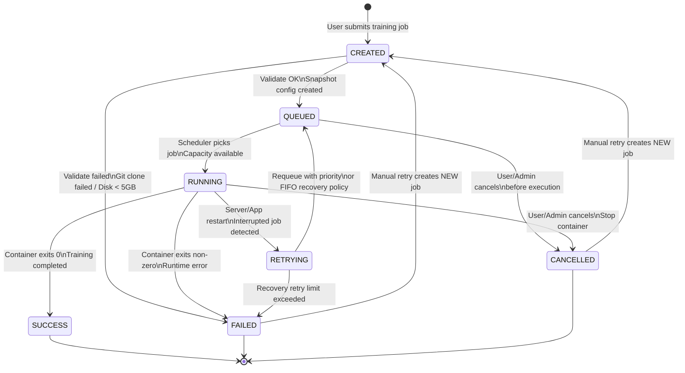

# Job Lifecycle State Diagram

Shows all valid states a training job can occupy and the transitions between them.

## State Meanings

| State | Meaning |
|---|---|
| `CREATED` | Job record exists; validation in progress |
| `QUEUED` | Validation passed; waiting for execution slot |
| `RUNNING` | Docker container active; streaming logs |
| `SUCCESS` | Container exited 0; artifacts registered |
| `FAILED` | Container exited non-zero or platform error |
| `CANCELLED` | Stopped by user or admin |
| `RETRYING` | Interrupted by restart; about to be requeued |

## Key Rules
- `RETRYING` → `QUEUED` reruns from the beginning (no checkpointing in MVP)
- Manual retry (`FAILED`/`CANCELLED` → `CREATED`) always creates a **new job** with a new Job ID
- Email notification fires on `RUNNING → SUCCESS` and `RUNNING → FAILED`

## Related
- [[queue-flow-diagram]] — Detailed QUEUED → RUNNING dispatch flow
- [[recovery-flow-diagram]] — RUNNING → RETRYING on restart
- [[error-flow-diagram]] — Error handling per failure type
- [[training-execution-sequence-diagram]] — End-to-end execution flow
- [[erd]] — `TRAINING_JOBS.status` field
- [[ADR-005]] — Queue persistence decision
- [[non-functional-requirements]] — NFR-REL-003, NFR-REL-004
