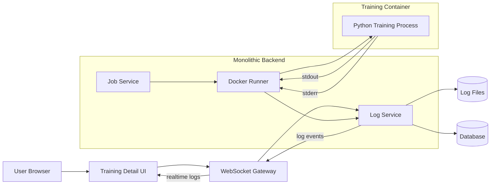

# Log Streaming Architecture Diagram

Shows how stdout/stderr from the Docker training container reaches the user's browser via WebSocket.

## Key Points

- Both `stdout` and `stderr` are captured and streamed
- Logs are persisted to disk AND pushed via WebSocket simultaneously
- `JobStreamWebSocketHandler` (Observer pattern) fans out events to all subscribed browser sessions
- Logs remain available for historical viewing after job completion
- WebSocket auth required: backend validates ownership before subscribing

## Related
- [[progress-event-flow-diagram]] — Progress events on the same channel
- [[realtime-state-flow]] — Frontend WebSocket reconnect and fallback
- [[ADR-008]] — WebSocket decision
- [[ADR-015]] — Observer pattern (JobStreamWebSocketHandler)
- [[non-functional-requirements]] — NFR-PERF-003 (≤ 5s latency), NFR-OBS-004 (log retention)
- [[storage-layout-diagram]] — Where log files are stored
