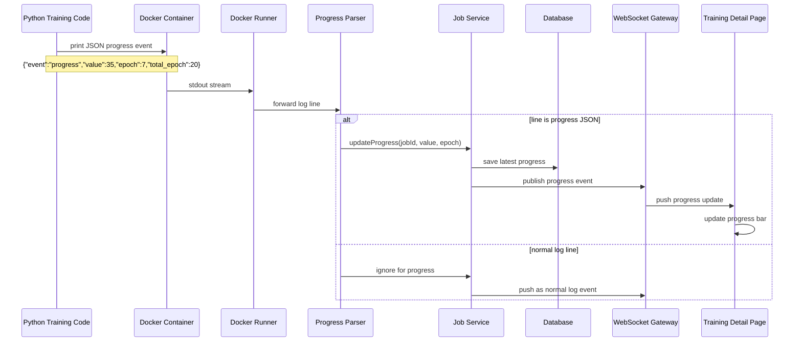

# Progress Event Flow Diagram

Shows how Python training code emits structured progress events that flow through the platform to update the UI progress bar.



## Progress Contract

Training code should emit structured JSON to stdout:
```json
{"event": "progress", "value": 35, "epoch": 7, "total_epoch": 20}
```

If no progress events are emitted, the UI displays `Progress Information Not Available` (see [[non-functional-requirements]] NFR-UX-002).

## Related
- [[log-streaming-architecture-diagram]] — Log channel (same WebSocket stream)
- [[realtime-state-flow]] — Frontend state updates
- [[sa-refinement]] — Section 15A: progress tracking requirements
- [[non-functional-requirements]] — NFR-UX-002
