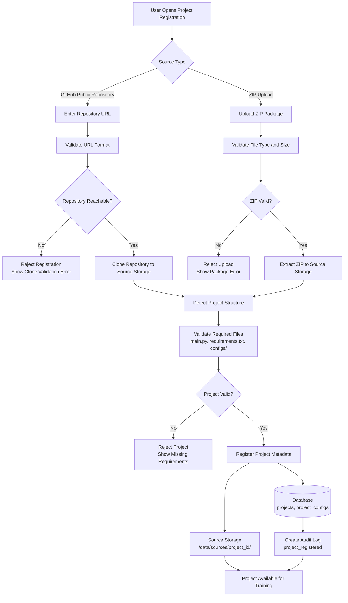

# Project Registration Flow Diagram

Shows how a project is registered from either a GitHub URL or a ZIP upload, including validation and storage steps.

## Required Project Files

Every project must have:
- `main.py` — training entry point
- `requirements.txt` — Python dependencies
- `configs/` — YAML configuration directory

## Related
- [[storage-layout-diagram]] — `/data/sources/` path
- [[configuration-management-flow-diagram]] — Config loading after registration
- [[sa-refinement]] — Sections 2 and 4: source management and config
- [[erd]] — `PROJECTS` and `PROJECT_CONFIGS` tables
- [[non-functional-requirements]] — NFR-SEC-006 (ZIP path traversal validation)
- [[failure-handling-matrix]] — GitHub clone failure and ZIP validation failure rows
