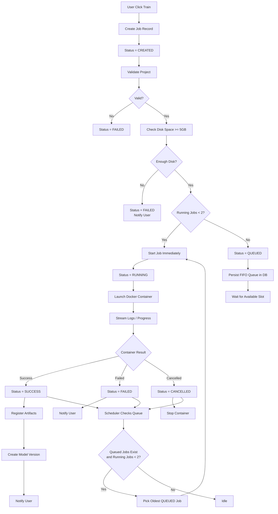

# Queue Flow Diagram

Shows the complete flow from a user clicking "Train" to job dispatch, execution, and artifact registration. Includes the FIFO queue waiting path.

## Dispatch Rules

- Max **2 concurrent RUNNING jobs** at any time
- Queue capacity: **50 queued jobs**
- Dispatcher runs every **2 seconds** (see [[non-functional-requirements]] NFR-PERF-006)
- Jobs are dispatched in FIFO order (by `enqueued_at`)

## Related
- [[job-lifecycle-state-diagram]] — State machine for all transitions
- [[recovery-flow-diagram]] — What happens to RUNNING jobs on restart
- [[training-execution-sequence-diagram]] — Detailed execution sequence
- [[capacity-scalability-view]] — MVP limits and future scalability
- [[ADR-005]] — Queue persistence decision
- [[sa-refinement]] — Queue survival requirements (section 5)
