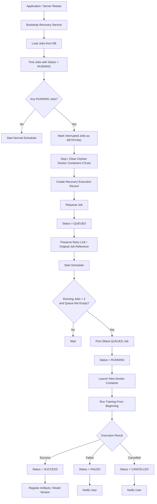

# Recovery Flow Diagram

Shows the startup recovery process when the server or application restarts with RUNNING jobs in the database.

## Recovery Rules

- Interrupted jobs run from the beginning (no checkpointing in MVP)
- `RUNNING → RETRYING → QUEUED` — the original job reference is preserved
- Orphan Docker containers are stopped and cleaned up
- Recovery runs at application bootstrap (`JobReconcilerService`)

## Related
- [[job-lifecycle-state-diagram]] — RETRYING state in the state machine
- [[queue-flow-diagram]] — Normal dispatch flow reused after recovery
- [[ADR-005]] — Queue persistence survives restart
- [[non-functional-requirements]] — NFR-REL-003, NFR-REL-004
- [[sa-refinement]] — Section 6: Running Job Recovery requirements
- [[failure-handling-matrix]] — "Server or app restart" row
