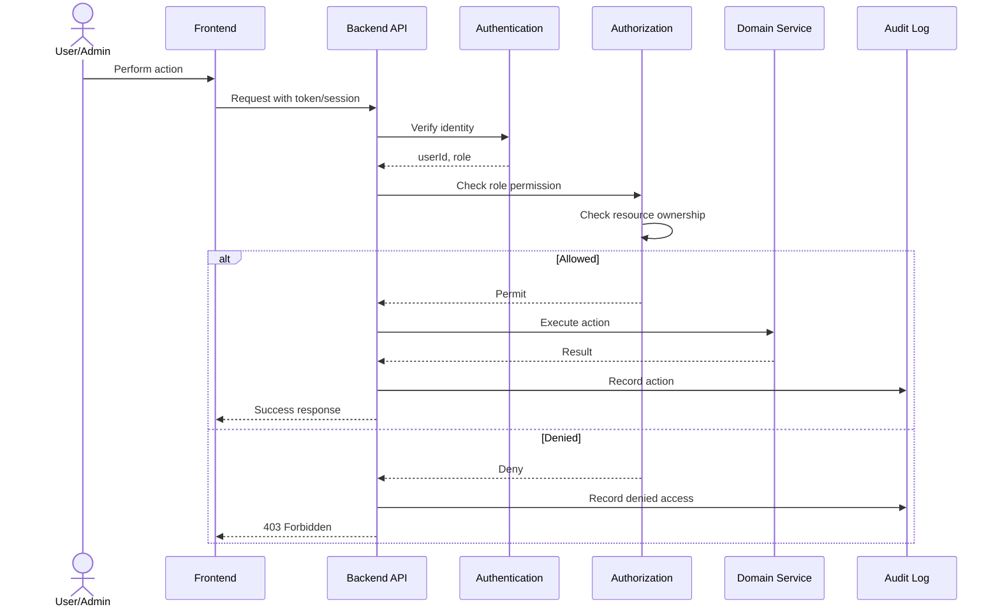

# Request Authorization Flow

Shows the authentication and authorization sequence for every protected API request.

## Implementation Notes

- `WebConfig extends OncePerRequestFilter` extracts `Authorization: Bearer` header and stores user in `CurrentUserContext` (thread-local)
- `AuthorizationService.require*()` methods enforce RBAC + ownership
- Every successful and denied action is recorded in the audit log
- `GET /api/v1/health` is the only unauthenticated endpoint

## Related
- [[security-architecture-diagram]] — Architectural view of auth layers
- [[access-control-matrix]] — What each role can do
- [[security-model]] — RBAC + Ownership model theory
- [[ADR-007]] — Authentication decision
- [[ADR-015]] — Chain of Responsibility (WebConfig) and Facade (AuthorizationService)
