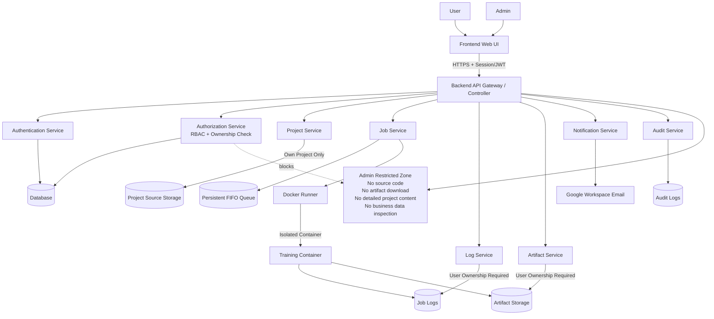

# Security Architecture Diagram

Shows the authentication and authorization layers from the frontend to backend services, including the admin restriction zone.

## Key Security Rules

- All REST endpoints AND WebSocket subscriptions require authentication
- `AuthorizationService` (Facade pattern) is the single entry point for all RBAC decisions
- Admins can cancel jobs and delete projects but cannot see source code, logs, or artifacts
- Every request goes through `WebConfig` filter (Chain of Responsibility) to resolve user identity

## Related
- [[request-authorization-flow]] — Request-level auth sequence
- [[access-control-matrix]] — Per-action permission table
- [[security-model]] — RBAC + Ownership model explanation
- [[ADR-007]] — Authentication decision
- [[ADR-015]] — Facade (AuthorizationService) and Chain of Responsibility (WebConfig)
- [[non-functional-requirements]] — NFR-SEC-001 to NFR-SEC-008
