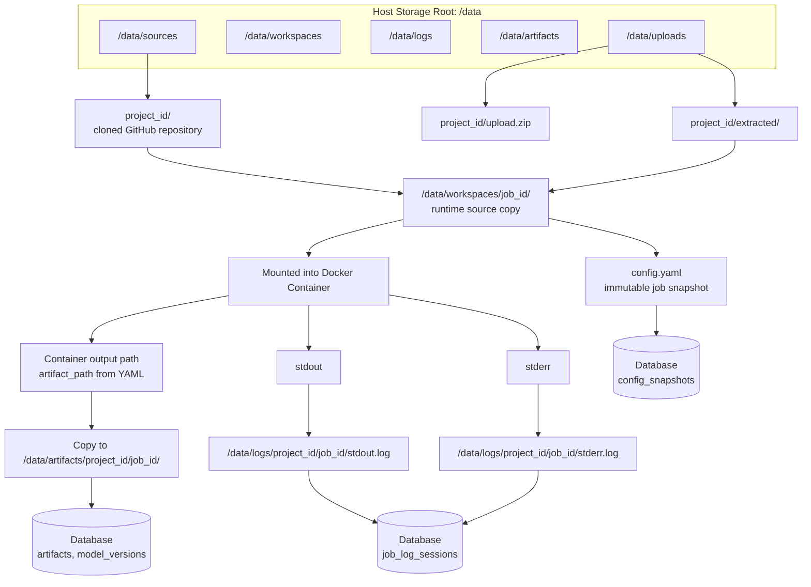

# Storage Layout Diagram

Shows the physical directory structure under the host storage root `/data` and how each path relates to Docker containers and database metadata.

## Path Convention

| Path | Contents |
|---|---|
| `/data/sources/{project_id}/` | Cloned GitHub repo or extracted ZIP |
| `/data/uploads/{project_id}/` | Raw ZIP upload |
| `/data/workspaces/{job_id}/` | Runtime copy mounted into container |
| `/data/logs/{project_id}/{job_id}/` | stdout.log + stderr.log |
| `/data/artifacts/{project_id}/{job_id}/` | Copied artifact files |

## Related
- [[deployment-diagram]] — Server where `/data` lives
- [[artifact-flow-diagram]] — Artifact copy process
- [[project-registration-flow-diagram]] — Where `/data/sources/` is populated
- [[ADR-009]] — Local storage decision and path conventions
- [[non-functional-requirements]] — NFR-STO-001 to NFR-STO-005
