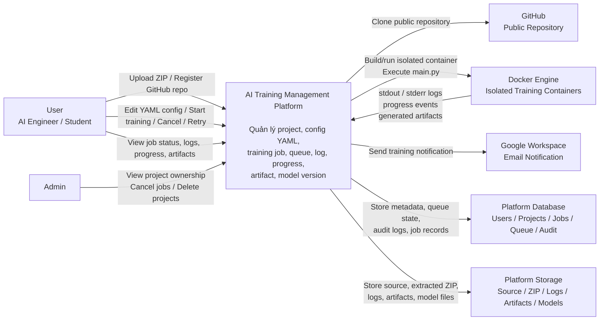

# System Context Diagram

Shows all actors and external systems that interact with the AI Training Management Platform, and the nature of each interaction.

## Context Notes

- **Users** are AI Engineers who register projects and manage training jobs
- **Admins** have limited visibility: project names, ownership, and the ability to cancel jobs or delete projects — they cannot access source code, logs, or artifacts
- **GitHub** — only public repos; no auth tokens required
- **Docker Engine** — runs on the same server as the backend; containers are the execution boundary
- **Google Workspace** — email notifications on SUCCESS/FAILED (failure doesn't affect job status)
- **Storage** — local POSIX filesystem under `/data`; see [[storage-layout-diagram]]
- **Database** — MongoDB 8; see [[erd]] for the full data model

## Related
- [[high-level-component-diagram]] — Internal module breakdown
- [[deployment-diagram]] — Physical server topology
- [[security-architecture-diagram]] — Auth and RBAC context
- [[ADR-006]] — Docker execution decision
- [[ADR-007]] — Authentication decision
- [[ADR-009]] — Storage decision
- [[ADR-010]] — Notification decision
