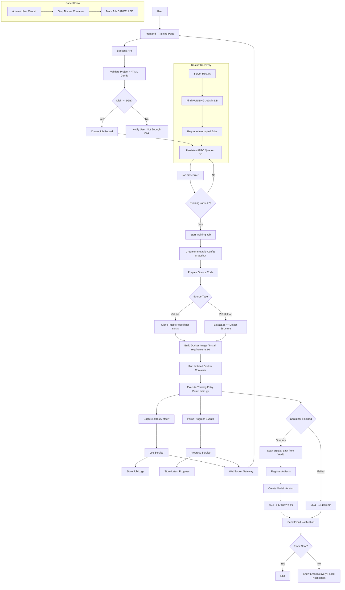

# Training Execution Sequence Diagram

End-to-end flow from the user clicking "Train" to job completion, including Docker container lifecycle, artifact registration, and email notification.

## Image resolution invariant

The per-project Docker image (`project-{projectId}`) is normally **built once at registration** with the project's `requirements.txt` baked in; each job then reuses it. The `Detect Structure` step resolves the **project root** — descending into a single top-level wrapper folder (e.g. the macOS `Archive.zip` → `iris-classifier/` layout) so `requirements.txt` sits at the build-context root.

That same resolved project root must be used in three places, or dependencies silently go missing:

1. **Build** (registration) — the `docker build` context.
2. **Mount** (every run) — the directory mounted read-only at `/source`.
3. **Rebuild** (run time, only if the image is absent) — the `docker build` context used to regenerate the image on demand.

If `Build` and `Mount`/`Rebuild` disagree (e.g. building from the inner folder but mounting/rebuilding the outer one), `pip install` runs against a context without `requirements.txt`, producing a dependency-less image and a `ModuleNotFoundError` at run time (notably on **retry**, when the image may have been pruned and is rebuilt on demand). When the image is missing **and** no source is available to rebuild, the job **fails** rather than falling back to the dependency-less base image — see [[failure-handling-matrix]].

## Related
- [[job-lifecycle-state-diagram]] — State machine overview
- [[queue-flow-diagram]] — Queue and dispatch detail
- [[recovery-flow-diagram]] — Restart recovery path
- [[artifact-flow-diagram]] — Artifact copy and registration
- [[progress-event-flow-diagram]] — Progress event parsing
- [[log-streaming-architecture-diagram]] — Log WebSocket streaming
- [[configuration-management-flow-diagram]] — Config snapshot creation
- [[ADR-006]] — Docker execution
- [[ADR-008]] — WebSocket streaming
- [[ADR-009]] — Storage for logs and artifacts
- [[ADR-010]] — Email notification
