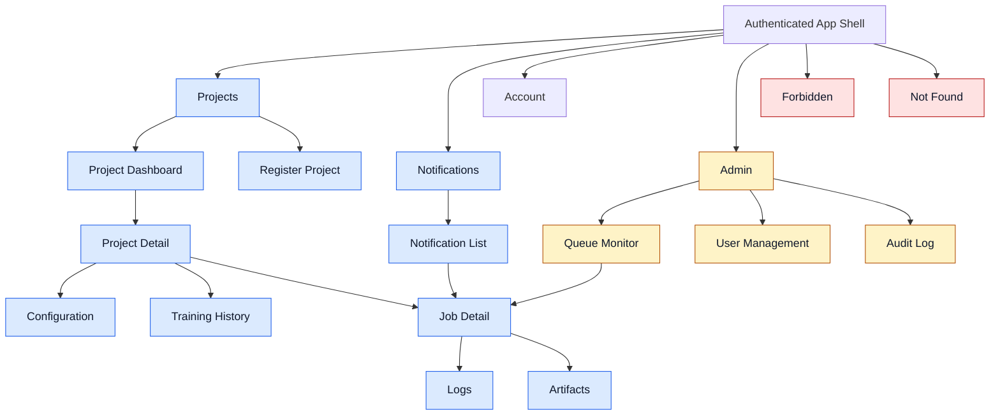

# Information Architecture Diagram

Shows the navigation hierarchy and page ownership for the authenticated application shell.

## Related
- [[information-architecture]] — IA text documentation
- [[route-guard-flow]] — Route access control
- [[frontend-architecture]] — Route table and component mapping
- [[user-screens]] — User-facing screen mockups (screens 01–08)
- [[admin-screens]] — Admin screen mockups (screens 09–11)
