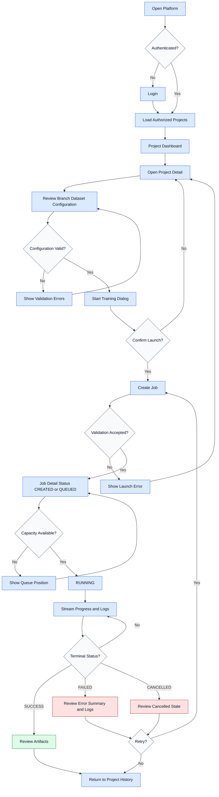

# Primary User Flow Diagram

Core training workflow from platform open to training completion and next steps.

## Related
- [[user-flows]] — Task-level flow documentation
- [[information-architecture-diagram]] — Navigation hierarchy
- [[journey-maps]] — End-to-end journey context
- [[job-lifecycle-state-diagram]] — Job states in this flow
- [[queue-flow-diagram]] — Queue position mechanics
